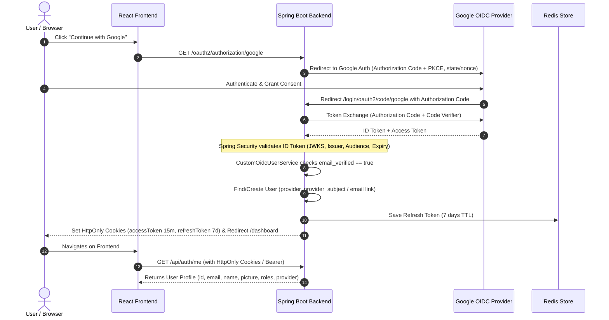

# 🔗 URL Shortener with Analytics Dashboard

A **scalable full-stack URL Shortener platform** that allows users to generate short URLs and track detailed analytics such as **click count, location, device type, and browser information** through a modern dashboard.

This project demonstrates **backend architecture, scalable event tracking, and modern frontend development practices.**

---

## 🚀 Project Overview

The system allows users to:

- Convert **long URLs into short shareable links**
- Redirect users instantly when the short URL is accessed
- Track **user click analytics**
- View **real-time analytics dashboard**
- Analyze traffic by **device, browser, and location**

---

## 🛠️ Tech Stack

### Frontend
- React.js
- JavaScript (ES6+)
- CSS
- Axios
- React Router

### Backend
- Java
- Spring Boot
- REST APIs
- Spring Data JPA

### Database
- MySQL

### Event Processing (Analytics)
- Event logging architecture for scalable click tracking

### DevOps / Deployment
- Docker
- Railway Cloud Deployment
- GitHub

---

## ⚙️ Features

### 🔗 URL Shortening
- Convert long URLs into short unique URLs
- Collision-safe short URL generation

### 🔁 Instant Redirection
- Fast HTTP redirection
- Optimized response handling

### 📊 Click Analytics
Tracks user information including:
- Click timestamp
- Device type
- Browser
- Location
- Referrer

### 📈 Analytics Dashboard
Visual overview of:
- Total clicks
- Device distribution
- Browser usage
- Traffic sources

---

## 🔐 Authentication & IAM

The application implements dual-authentication support: standard email/password login and **OAuth 2.0 / OpenID Connect (OIDC)** with Google as the Identity Provider (IdP).

### 🔄 Authorization Code + PKCE Flow & Token Strategy

### 🗝️ Token Strategy

1. **IdP Token Exchange**: The Google ID Token is received and validated automatically by Spring Security's `OidcUserService` using standard JWKS endpoint verification.
2. **Internal JWT Issuance**: Upon successful validation, internal tokens are issued:
   - **Access Token**: Short-lived (15 minutes) signed JWT containing subject and roles.
   - **Refresh Token**: Opaque UUID stored in **Redis** with a 7-day TTL.
3. **Transport Mechanism**: Tokens are delivered as `HttpOnly`, `SameSite=Lax` cookies, preventing XSS token extraction.

### 🛡️ Role-Based Access Control (RBAC)

| Role | Permitted Endpoints & Actions |
| :--- | :--- |
| **Anonymous / Public** | `/api/auth/public/**`, `/s/**`, `/oauth2/**`, `/login/oauth2/**`, `/actuator/health` |
| **ROLE_USER** | `/api/auth/me`, `/api/auth/logout`, `/api/urls/**`, `/api/url/**`, `/api/myurls`, `/api/analytics/**`, `/api/totalClicks` |
| **ROLE_ADMIN** | All user endpoints + `@PreAuthorize("hasRole('ADMIN')")` routes (e.g., `/api/auth/admin/**`) |

### 🔒 Key Security Decisions

- **HttpOnly Cookies**: Prevents client-side JavaScript from reading access/refresh tokens, protecting against XSS token theft.
- **No Tokens in Redirect URLs**: Tokens are never exposed in URL query parameters or browser history during redirects.
- **Mandatory `email_verified` Check**: OIDC logins are rejected if `email_verified` claim is false. Account linking only occurs for verified emails.
- **Least Privilege & Role Isolation**: Roles from external IdPs are untrusted; all OIDC users are explicitly assigned `ROLE_USER` locally.
- **Rate Limiting**: Authentication endpoints are rate-limited via Redis to prevent brute-force attacks.

